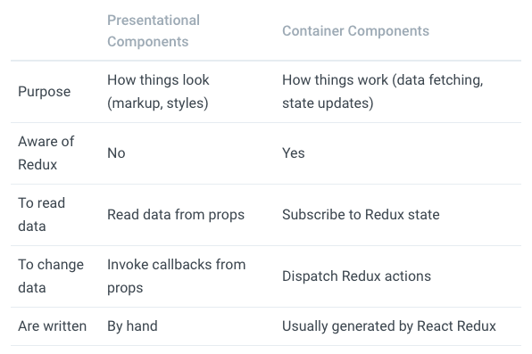

# start-redux

Redux is a predictable state container for JavaScript apps.

## Install

```bash
npm install --save redux

npm install --save react-redux
npm install --save-dev redux-devtools
```

## Principles

`Single source of truth`: The state of your whole application is stored in an object tree within a single store.  
`State is read-only`: The only way to change the state is to emit an action, an object describing what happened.  
`Changes are made with pure functions`: To specify how the state tree is transformed by actions, you write pure reducers.

## Concept

### Action

An action is a plain JavaScript object that describes what happened.

#### Action Creator

functions that crate actions.

```js
function addTodo(text) {
  return {
    type: ADD_TODO, // `type` property  필수
    text,
  };
}
dispatch(addTodo(text));
// or
const boundAddTodo = text => dispatch(addTodo(text)); // bound action creator
boundAddTodo(text);
```

```js
export const ADD_TODO = 'ADD_TODO';
export const TOGGLE_TODO = 'TOGGLE_TODO';
export const SET_VISIBILITY_FILTER = 'SET_VISIBILITY_FILTER';

export const VisibilityFilters = {
  SHOW_ALL: 'SHOW_ALL',
  SHOW_COMPLETED: 'SHOW_COMPLETED',
  SHOW_ACTIVE: 'SHOW_ACTIVE',
};

export function addTodo(text) {
  return { type: ADD_TODO, text };
}

export function toggleTodo(index) {
  return { type: TOGGLE_TODO, index };
}

export function setVisibilityFilter(filter) {
  return { type: SET_VISIBILITY_FILTER, filter };
}
```

### Reducer

Reducers specify how the application's state changes in response to actions sent to the store

> (previousState, action) => newState;

```js
import { combineReducers } from 'redux';

import {
  ADD_TODO,
  TOGGLE_TODO,
  SET_VISIBILITY_FILTER,
  VisibilityFilters,
} from './actions';

const { SHOW_ALL } = VisibilityFilters;

const initialState = {
  visibilityFilter: VisibilityFilters.SHOW_ALL,
  todos: [],
};

function todos(state = [], action) {
  switch (action.type) {
    case ADD_TODO:
      return [
        ...state,
        {
          text: action.text,
          completed: false,
        },
      ];
    case TOGGLE_TODO:
      return state.map((todo, index) => {
        if (index === action.index) {
          return {
            ...todo,
            completed: !todo.completed,
          };
        }
        return todo;
      });
    default:
      return state;
  }
}

function visibilityFilter(state = SHOW_ALL, action) {
  switch (action.type) {
    case SET_VISIBILITY_FILTER:
      return action.filter;
    default:
      return state;
  }
}

const todoApp = combineReducers({
  visibilityFilter,
  todos,
});

// function todoApp(state = {}, action) {
//   return {
//     visibilityFilter: visibilityFilter(state.visibilityFilter, action),
//     todos: todos(state.todos, actin),
//   };
// }
export default todoApp;
```

### Store

- Holds application state;
- Allows access to state via `getState()`;
- Allows state to be updated via `dispatch(action)`;
- Registers listeners via `subscribe(listener)`;
- Handles `unregistering` of listeners via the function returned by `subscribe(listener)`.

> It's important to note that you'll only have a single store in a Redux application.

```js
cimport { createStore } from 'redux';
import todoApp from './reducers';
import {
  addTodo,
  toggleTodo,
  setVisibilityFilter,
  VisibilityFilters,
} from './actions';

const store = createStore(todoApp);

const unsubscribe = store.subscribe(() => console.log(store.getState()));

store.dispatch(addTodo('Learn about actions'));
store.dispatch(addTodo('Learn about reducers'));
store.dispatch(addTodo('Learn about store'));
store.dispatch(toggleTodo(0));
store.dispatch(toggleTodo(1));
store.dispatch(setVisibilityFilter(VisibilityFilters.SHOW_COMPLETED));

unsubscribe();
```

## With React

### Presentational and Container Components



`connect()`

`mapStateToProps`

`mapDispatchToProps`

## Reference

- [Redux](https://redux.js.org/)
- [[번역] 프레젠테이션 컴포넌트와 컨테이너 컴포넌트](https://blueshw.github.io/2017/06/26/presentaional-component-container-component/?no-cache=1)
- [Typechecking With PropTypes](https://reactjs.org/docs/typechecking-with-proptypes.html)
